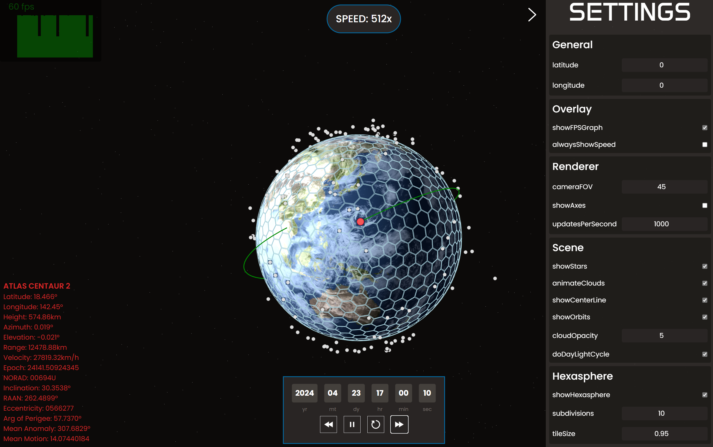

# Galileo Tracker


Galileo is a basic object tracker inspired by sites such as [SatelliteTracker3D](https://satellitetracker3d.com/), [StarlinkMap](https://satellitemap.space/), and [KeepTrack](https://github.com/thkruz/keeptrack.space). Galileo currently uses [satellite.js](https://github.com/shashwatak/satellite-js) and its SGP4 calculations for forward and backward object propogation. It is designed for flexible development, and with a smooth user experience in mind.



Galileo is built using ES2020 and Vite. To run locally, install git and node.

## Set up a Local Copy

```bash
git clone https://github.com/speer-ai/galileo-app         # Clone files to local
cd ./galileo-app/                                         # Switch into the directory
npm install                                               # Install dependencies
```

then either

```bash
npm run dev                                               # Run a hot dev version
```

or 

```bash
npm run build                                             # Build the project
npm start                                                 # Start the server
```

to start a copy.

## Interface and Usage
Galileo displays a fullscreen rendering of earth and sattelites using [@react-three-fiber](https://github.com/pmndrs/react-three-fiber) and [Tailwind.css](https://tailwindcss.com/) to style the page. Galileo allows for past & future date manipulation and provides many keyboard shortcuts for users to navigate between objects. Galileo features other visuals such as orbit displays, a dynamic hexasphere, and more.

The Settings panel lets you enter your latitude and longitude manually. You can also click **Use Browser Location** to automatically populate these coordinates from your web browser if geolocation is available.

## Possible Future Updates
Galileo may be updated in the future to allow use with live sensors & data and/or the ability to control local communication devices.

- Hook up live feed (camera maybe)
- Control physical antenna
- Detect, track, and predict trajectories of objects (not necessary satellites)

## Version
Galileo Tracker v1.0

View source code on [Github](https://github.com/speer-ai/galileo-app)

## Bugs & Inefficiencies
- At certain angles, all objects will disappear from view (likely not in frustrum)
- Object corner textures visible at certain angles

- Switch time zone?
- Some calculations redundant
- Can't enter date manually into panel
- Switch between ECI / ECF coordinates
